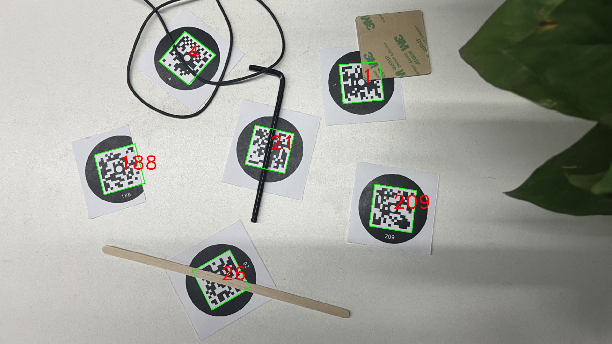

# CopperTag

CopperTag is a fiducial marker that integrates a circular and square to form a robust and occlusion-resilient pattern. It can detect successfully even under some occlusion conditions and can tolerate up to two missing corners or 30% missing area. It uses the Reed-Solomon algorithm to encode and decode the information content.



## Code Dependencies

Before you can use CopperTag, make sure you have the following dependencies installed:

- OpenCV (> 4.3)
- Yaml-CPP
- Eigen3

The code also needs to be compiled with the C++17 standard.

## Compilation

To compile CopperTag, follow these steps:

```bash
mkdir build && cd build
cmake -DCMAKE_BUILD_TYPE=Release ..
make
```

## Usage
To test CopperTag, follow these steps:
```bash
cd bin
./coppertag "test_image.jpg"
```

## Dataset
A dataset that containing simulations, physical environments, usual images and occlusion images can be downloaded from [google drive](https://drive.google.com/drive/folders/1al6iWGvUWLP2QdQiYIq_z2CAR__72UVJ?usp=drive_link)